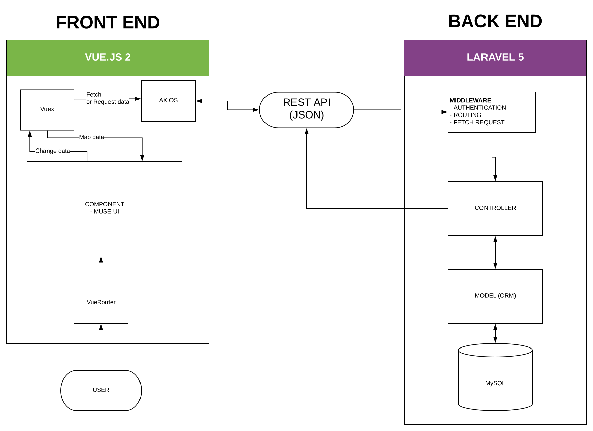

# HOW THIS APP WORK

> Relate Docs: [TECHNICAL STACK](TECHNIAL_STACK.md)

## Main structure

This app is split into 2 part: **frontend** and **backend**

**Frontend** is [Vue Framework](#), build by Vue CLI 3

**Backend** is [Laravel Framework](#), serve API to **Frontend**

**Frontend** communicate and sync data through *REST API* served by **Backend**

**Example**:
1. User goto app website
2. Vue render main component, when render,
*Vuex* send request like `/api/me` to **backend** for get user
3. *Laravel* handle request `/api/me`, get data by ORM Eloquent, return JSON to **frontend**.
Like `{name: "Anon", role: "admin"}`.
4. *Vuex* in frontend receive response, collect data from JSON and map to Vue Component

**Example 2:**
1. User submit a form, like *Add a medicine*.
2. Vue get form input, create a `POST` request and send to `/api/medicine/create`.
3. Laravel receive request `/api/medicine/create` and input in request body.
4. Laravel create data into MySQL through ORM, and an response if success or not.
5. Vue receive response and notify to user in the screen, reload data and map data to component again.



## Frontend

- UI Component rendered by [Vue](), using lots of component of UI Framework [MuseUI](https://muse-ui.org/).

- Frontend is a Single Page Application, *routing* by [VueRouter](https://router.vuejs.org/).
    1. VueRouter define a route like `/medicine/:id?filter=xyz`.
    2. User goto `/medicine/123`, VueRouter match to variable `params = {id: 123}` and `search = {filter: 'xyz'}`
    3. In Vue Component, we can access `id` or `filter` by this way:
       ```typescript
           const medicineID = this.$route.params.id;
           const filter = this.$route.search.filter;
       ```
    
    
- State Management using [Vuex](https://vuex.vuejs.org/)

- Handle authentication with Backend by `JWT`, generate by Laravel Passport, just using it.

## Backend

- Laravel version 5
- Authentication & Generate JWT by Laravel Passport.

Backend has 2 part:
1. Serve index.html by `App/Http/Controller/SpaController`, route at `routes/web.php`
2. Others Controller handle api request at `routes/api.php`

## HOW TO RUN AT LOCALHOST

[Document here](README.md)
